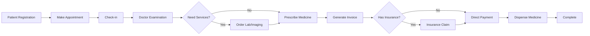
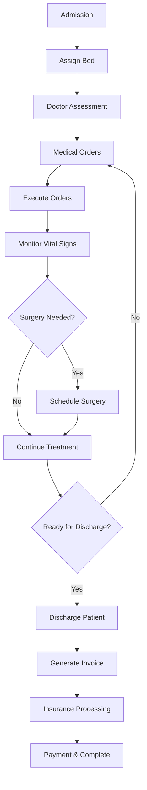
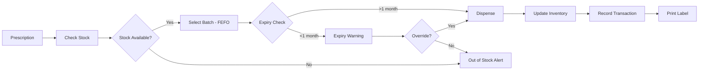

# ??? HIS DATABASE ER DIAGRAM

Generated: 2026-01-28 13:27:37

## Mermaid ER Diagram

```mermaid
erDiagram
    %% Core Module
    Patients ||--o{ Appointments : "has"
    Patients ||--o{ Encounters : "has"
    Patients ||--o{ Allergies : "has"
    Patients ||--o{ MedicalHistories : "has"
    Patients ||--o{ Admissions : "admitted"
    Patients ||--o{ InsuranceClaims : "claims"
    
    Departments ||--o{ Staffs : "employs"
    Departments ||--o{ Wards : "contains"
    
    Staffs ||--o{ Appointments : "attends"
    Staffs ||--o{ Encounters : "performs"
    Staffs ||--o{ Prescriptions : "prescribes"
    Staffs ||--o{ PharmacyDispenses : "dispenses"
    Staffs ||--o{ Admissions : "treats"
    Staffs ||--o{ MedicalOrders : "orders"
    Staffs ||--o{ VitalSigns : "records"
    Staffs ||--o{ Surgeries : "performs"
    
    TimeSlots ||--o{ Appointments : "scheduled"
    
    %% Appointment & Encounter Flow
    Appointments ||--o| Encounters : "leads to"
    
    Encounters ||--o{ Orders : "includes"
    Encounters ||--o{ Prescriptions : "generates"
    Encounters ||--o| Invoices : "billed"
    Encounters ||--o| InsuranceClaims : "claimed"
    
    Services ||--o{ Orders : "ordered"
    Orders ||--o| OrderResults : "results in"
    
    %% Pharmacy Module
    Medicines ||--o{ MedicineBatches : "has batches"
    Medicines ||--o{ PrescriptionItems : "prescribed"
    
    MedicineBatches ||--o{ DispenseItems : "dispensed from"
    MedicineBatches ||--o{ InventoryTransactions : "tracked"
    
    Prescriptions ||--o{ PrescriptionItems : "contains"
    Prescriptions ||--o{ PharmacyDispenses : "dispensed"
    Prescriptions ||--o{ MedicalOrders : "ordered"
    
    PharmacyDispenses ||--o{ DispenseItems : "includes"
    
    %% Inpatient Module
    Wards ||--o{ Beds : "contains"
    Beds ||--o{ Admissions : "occupies"
    
    Admissions ||--o{ MedicalOrders : "has"
    Admissions ||--o{ VitalSigns : "monitored"
    Admissions ||--o{ Surgeries : "undergoes"
    Admissions ||--o| InsuranceClaims : "claimed"
    
    %% Insurance Module
    InsuranceClaims ||--o{ InsuranceClaimItems : "itemizes"
    Invoices ||--o| InsuranceClaims : "covered by"
    
    %% Entity Details
    Patients {
        int PatientId PK
        string FullName
        date Dob
        int Gender
        string Phone
        string Address
        string IdentityNumber
        string InsuranceNumber
        datetime InsuranceExpiry
        string InsuranceType
        decimal InsuranceCoveragePercent
        string InsuranceHospital
    }
    
    Departments {
        int DepartmentId PK
        string Code UK
        string Name
    }
    
    Staffs {
        int StaffId PK
        string FullName
        int DepartmentId FK
        string StaffType
    }
    
    TimeSlots {
        int TimeSlotId PK
        string Code UK
        time Start
        time End
    }
    
    Services {
        int ServiceId PK
        string Name
        string Type
        decimal Price
    }
    
    Appointments {
        int AppointmentId PK
        int PatientId FK
        int DoctorId FK
        int TimeSlotId FK
        date AppointmentDate
        int Status
        string Note
    }
    
    Encounters {
        int EncounterId PK
        int PatientId FK
        int DoctorId FK
        int AppointmentId FK
        datetime CheckInAt
        int Status
        string Diagnosis
        string Conclusion
        datetime EndAt
    }
    
    Orders {
        int OrderId PK
        int EncounterId FK
        int ServiceId FK
        int Status
        string OrderedBy
        datetime OrderedAt
    }
    
    OrderResults {
        int OrderResultId PK
        int OrderId FK-UK
        string Result
        string PerformedBy
        datetime PerformedAt
        string VerifiedBy
        datetime VerifiedAt
    }
    
    Medicines {
        int MedicineId PK
        string Code UK
        string Name
        string ActiveIngredient
        string Unit
        string Manufacturer
        bool RequiresPrescription
        string Description
        bool IsActive
    }
    
    MedicineBatches {
        int MedicineBatchId PK
        int MedicineId FK
        string BatchNumber
        date ManufactureDate
        date ExpiryDate
        decimal UnitPrice
        int QuantityInStock
        int MinStockLevel
        bool IsActive
    }
    
    Prescriptions {
        int PrescriptionId PK
        string Code UK
        int EncounterId FK
        int PrescribedBy FK
        datetime PrescribedAt
        int Status
        string Note
    }
    
    PrescriptionItems {
        int PrescriptionItemId PK
        int PrescriptionId FK
        int MedicineId FK
        int Quantity
        string Dosage
        string Instructions
        int Duration
    }
    
    PharmacyDispenses {
        int PharmacyDispenseId PK
        int PrescriptionId FK
        datetime DispensedAt
        int DispensedBy FK
        string Note
    }
    
    DispenseItems {
        int DispenseItemId PK
        int PharmacyDispenseId FK
        int MedicineBatchId FK
        int Quantity
        decimal UnitPrice
        decimal TotalPrice
    }
    
    InventoryTransactions {
        int InventoryTransactionId PK
        string TransactionCode
        int MedicineBatchId FK
        int Type
        int Quantity
        datetime TransactionDate
        int CreatedBy FK
        string Note
        string ReferenceCode
    }
    
    Wards {
        int WardId PK
        string Code UK
        string Name
        int DepartmentId FK
        int Type
        int TotalBeds
        bool IsActive
        string Description
    }
    
    Beds {
        int BedId PK
        int WardId FK
        string BedNumber UK
        int Status
        bool IsActive
        string Note
    }
    
    Admissions {
        int AdmissionId PK
        string AdmissionCode UK
        int PatientId FK
        int BedId FK
        int AttendingDoctorId FK
        datetime AdmittedAt
        datetime DischargedAt
        int Status
        string AdmissionReason
        string InitialDiagnosis
        string DischargeSummary
        string DischargeInstructions
        int DischargedBy FK
    }
    
    MedicalOrders {
        int MedicalOrderId PK
        string OrderCode
        int AdmissionId FK
        int OrderType
        string OrderDetails
        datetime OrderedAt
        datetime ScheduledAt
        int OrderedBy FK
        int Status
        datetime ExecutedAt
        int ExecutedBy FK
        string ExecutionNote
        string Note
        int PrescriptionId FK
    }
    
    VitalSigns {
        int VitalSignId PK
        int AdmissionId FK
        datetime RecordedAt
        int RecordedBy FK
        decimal Temperature
        int HeartRate
        int RespiratoryRate
        int BloodPressureSystolic
        int BloodPressureDiastolic
        decimal OxygenSaturation
        decimal Weight
        decimal Height
        string Note
    }
    
    Surgeries {
        int SurgeryId PK
        string SurgeryCode UK
        int AdmissionId FK
        string SurgeryType
        string Description
        datetime ScheduledAt
        int SurgeonId FK
        int AnesthesiologistId FK
        string OperatingRoom
        int Status
        datetime StartedAt
        datetime EndedAt
        string OperativeNotes
        string PostOpInstructions
        string Complications
    }
    
    Allergies {
        int AllergyId PK
        int PatientId FK
        string Allergen
        string Reaction
        int Severity
        datetime IdentifiedDate
        bool IsActive
        string Note
    }
    
    MedicalHistories {
        int MedicalHistoryId PK
        int PatientId FK
        string Condition
        datetime DiagnosedDate
        string Treatment
        bool IsActive
        string Note
    }
    
    InsuranceClaims {
        int InsuranceClaimId PK
        string ClaimCode UK
        int EncounterId FK
        int AdmissionId FK
        int PatientId FK
        string InsuranceNumber
        datetime InsuranceExpiry
        string InsuranceType
        decimal CoveragePercent
        decimal TotalAmount
        decimal InsuranceCovered
        decimal PatientPayment
        int Status
        datetime CreatedAt
        datetime SubmittedAt
        datetime ApprovedAt
        int ApprovedBy FK
        string Note
        string RejectReason
        string XmlData
    }
    
    InsuranceClaimItems {
        int InsuranceClaimItemId PK
        int InsuranceClaimId FK
        string ServiceName
        string ServiceCode
        int Quantity
        decimal UnitPrice
        decimal TotalPrice
        decimal InsurancePaid
        decimal PatientPaid
        bool IsInInsuranceList
        string Note
    }
    
    Invoices {
        int InvoiceId PK
        int EncounterId FK
        string InvoiceCode UK
        decimal TotalAmount
        decimal InsuranceAmount
        decimal PatientAmount
        bool HasInsurance
        int InsuranceClaimId FK
        int Status
        datetime CreatedAt
        datetime PaidAt
        string PaidBy
        string Note
        string TaxCode
        string EInvoiceCode
        datetime EInvoiceIssuedAt
    }
```

## Workflow Diagrams

### 1. Outpatient Flow


### 2. Inpatient Flow


### 3. Pharmacy FEFO Flow


## Statistics

- **Total Entities:** 31
- **Core Module:** 5 tables
- **Appointment Module:** 2 tables
- **Lab Module:** 3 tables
- **Pharmacy Module:** 7 tables
- **Inpatient Module:** 8 tables
- **Insurance Module:** 3 tables
- **Invoice Module:** 1 table

---

*Generated by HIS Database Schema Generator*
